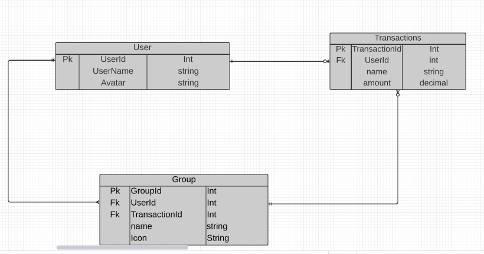
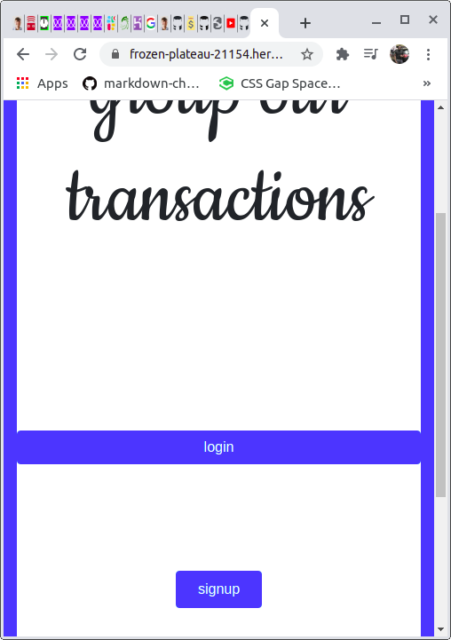
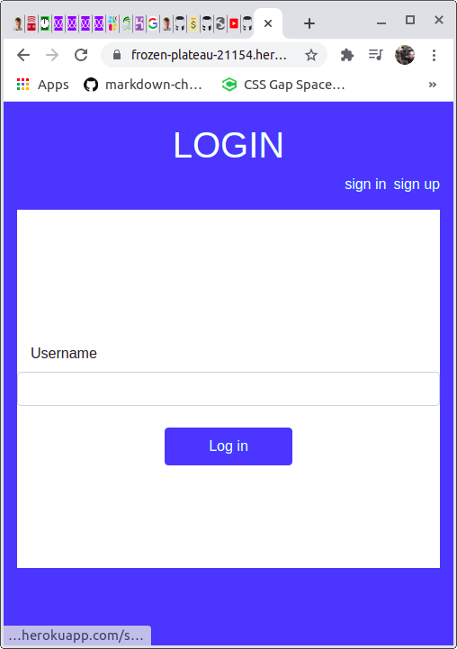
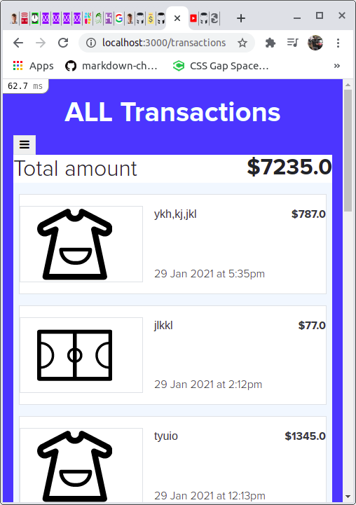

# ROR-Capstone: Grouping Transactions
This project  is based on a mobile version app for grouping transactions by goal with your family/friends.
## Basic Features and Usage:
- 1. Home screen
- 2. Basic login: One can log into the app with a user name or signup with a user name and a pofile   picture which is optional for sign up since it can be added during editing of user profile
- 3. Profile view with links to groups and created transactions
- 4. View all your grouped transactions
- 5. View all your  transactions without an assigned group
- 6. View all the groups made in the app.
- 7. View details for each transaction. (Can access them from grouped and ungrouped transaction views as well as from the group info view)
- 8. Make a new transaction, with or without it belonging to a group
- 9. View details for each group, which include the transactions owned by that group.
- 10. Make a new group.
  
# Screenshots

##   ERD(ENTITY RELATIONAL DIAGRAM)


# App Screenshots



# Presentations
##  Live Demo
[Live Demo Link](https://frozen-plateau-21154.herokuapp.com/)
##  Video Presentation
[Video Presentation Link](https://www.loom.com/share/99a5c481d46242e294dd935cfe3e6591)
## Built With

- Ruby v2.7.2
- Ruby on Rails v6.1.1'

## Getting Started

### Prerequisites

Ruby: 2.7.2
Rails: 6.1.1'
Postgres: >=9.5

To get a local copy up and running follow these simple example steps.
## Installation
- Clone the repository by typing this -> `git clone git@github.com:che30/ROR-Capstone.git` in any folder of your choice
- Next type the command `cd ROR-Capstone` 
- Checkout  to the feature branch by  typing `git checkout feature`
- Run the command `yarn install`
- Run the command `bundle install`
- Run the command `rails db:create` followed by `rails db:migrate`

### Usage

Start server by typing on your terminal:

```
    rails server
```

Open `http://localhost:3000/` in your browser.

### Run tests
Type the command
```
    rspec --format documentation
```
in order to execute rspec tests

## Author
👤 **Che Nsoh Blanchard**

- GitHub: [@che30](https://github.com/che30)
- Twitter: [@BlanchardNsoh](https://twitter.com/che55085128 )
- LinkedIn: [Che Blanchard](https://www.linkedin.com/in/che-nsoh-9455271b0/)

## 🤝 Contributing

Contributions, issues and feature requests are welcome!

Feel free to check the [issues page](issues/).

## Show your support

Give a ⭐️ if you like this project!

## Acknowledgments
My acknowledgement goes to the following without which this project would not have been a success
- Microverse for the general requirements.
- Design idea by Gregoire Vella on Behance.
- Flaticon.com and each individual designer for their icons used

## 📝 License

TBA
